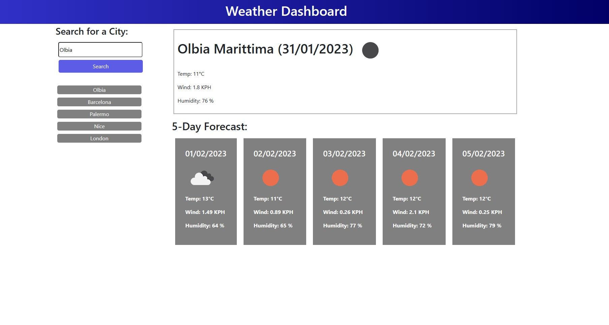

# Weather-Dashboard

## Description

This is a Weather Dashboard which allows the user to check the wheather forecast for a certain location. The user can see the daily forecast and also the forecast for the next five days. This Weather Dashboard also adds button for every location that the user search for.

## Screenshots
 

## Links

- Solution URL: [Solution URL here](https://github.com/KodeIva/Weather-Dashboard)
- Live Site URL: [Live site URL here](https://kodeiva.github.io/Weather-Dashboard/)

## Technologies used

- HTML5
- CSS 
- JavaScript
- jQuery
- Bootstrap
- Moment.js

###  Codes
- fetch()
- JSON.parse()
- JSON.stringify()
- prepend()
- append()
- for loop
- localStorage

## Installation

 N/A

## Credits

N/A

## License
[MIT](https://choosealicense.com/licenses/mit/)